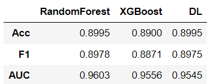
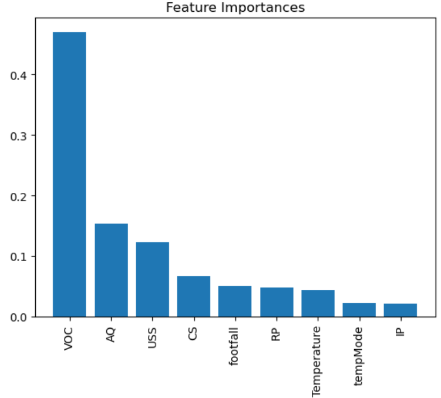
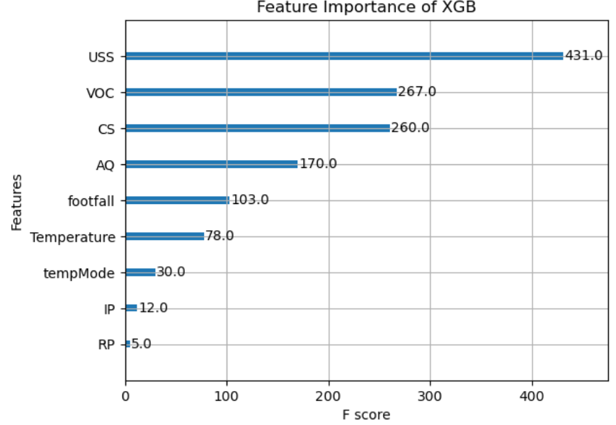

# Machine-Prediction

다양한 요소들을 통해 
기계의 성공/실패를 예측하는 프로젝트 
데이터의 특성에 대한 분석 이후 
**RandomForest**, **XGBoost**, **DNN**을 통해 예측하도록 한다.  

# Data

**footfall**: 기계 주변을 지나가는 사람이나 물체의 수. 
**tempMode**: 기계의 온도 모드 또는 설정. 
**AQ**: 기계 주변의 대기 질 지수. 
**USS**: 초음파 센서 데이터, 근접 측정값을 나타냄. 
**CS**: 전류 센서 판독값, 기계의 전기 사용량을 나타냄. 
**VOC**: 기계 주변의 휘발성 유기 화합물 수준. 
**RP**: 기계 부품의 회전 위치 또는 분당 회전수 (RPM). 
**IP**: 기계의 입력 압력. 
**Temperature**: 기계의 작동 온도. 
**fail**: 기계 고장 여부를 나타내는 이진 지표 (고장은 1, 정상은 0). 

[https://www.kaggle.com/datasets/umerrtx/machine-failure-prediction-using-sensor-data] 

# Results
  
   
결과를 살펴보면 Feature 중요도와 성능이 좋은 RandomForest의 결과가 가장 좋은 것으로 보인다. 
다만, RandomForest와 XGBoost의 Feature 중요도 결과가 다르기 때문에 이 부분을 확인해볼 필요성이 있다. 
DL 모델의 경우, PCA와 같은 embedding을 거친 후 예측 모델에 대입해보는 과정을 추가적으로 진행해볼 수 있다. 
또한 조금 더 복잡한 모델을 시도해볼 수 있다. 
